<div align="center">

# Capmon World

### Verifiable autonomous AI on Solana.

A hardware-attested proof-of-burn primitive, demonstrated through a working game.

Off-chain neural net plays Solana battles 24/7. Burns 50% of every win to grow each NFT's brain on-chain. Every signature is generated inside an Intel TDX enclave. Every receipt is publicly verifiable. No admin signature on the upgrade transaction itself.

[](https://solana.fm/address/FSenbAEVTgTdfM2723xkk8A2Y5oD8wtmB2EhiWXzpqSg?cluster=devnet-solana)
[](https://github.com/coral-xyz/anchor)
[](https://solana.com)
[](https://phala.network)
[](https://github.com/ticchu12-netizen/capbot-server)
[](LICENSE)
[](#-the-7-day-sprint)

**[▶ Play the game (capmon.fun)](https://capmon.fun)** · **[🪄 Mint + stake (play.capmon.fun)](https://play.capmon.fun)** · **[🔗 Live attestations + TEE quotes](https://capmon-hackathon.web.app/proof)** · **[📊 System dashboard](https://capmon-hackathon.web.app/dashboard)** · **[🎬 Watch a replay](https://capmon-hackathon.web.app/replay)** · **[𝕏 @capmonworld](https://x.com/capmonworld)**

</div>

---

## 🧠 What this is

Capmon World ships **two things at once**:

1. **An open-source primitive.** [`anchor-ed25519-introspection`](https://github.com/ticchu12-netizen/anchor-ed25519-introspection) is a small, focused Anchor crate that packages the Pattern 2 sigverify-ix introspection pattern — read and verify Ed25519 signatures from the Solana instructions sysvar inside your Anchor program. The pattern is documented in Solana's runtime docs but not packaged. Most teams either re-implement it ad-hoc (often missing edge cases like the cross-instruction sigverify footgun) or fall back to making their authority a transaction co-signer. The crate gives you the pattern as one well-documented function.

2. **A working game that demonstrates it.** Capmon World is a turn-based AI battler where staked NFTs autonomously play Solana battles 24/7. Each battle is a sealed proof-of-burn cycle: the autonomous server burns 50% of every win as Cap Coins, signs an Ed25519 message **inside a Phala Intel TDX enclave**, and submits it on-chain where an Anchor program verifies the signature out of the instructions sysvar and enforces tier-locked monotonic brain progression. The signing key never leaves the TEE. Every state change is publicly auditable.

The same Pattern 2 signing pattern that powers Capmon's brain progression can power: oracle-attested state mutations, rate-gated mints, escrow releases conditional on off-chain events, AI inference verification, time-locked admin actions. Anywhere you have an off-chain authority whose decisions you want to encode on-chain without making them a transaction co-signer.

Every brain upgrade receipt is at **[/proof](https://capmon-hackathon.web.app/proof)** with click-through to the on-chain transaction AND the raw Intel TDX hardware attestation quote that proves the signature came from the registered enclave measurement.

> **Hackathon submission:** Public Goods Track · Canada Prize Track · Solana Frontier (main)
> **Built:** 7-day solo sprint, May 2026
> **Status:** Live on devnet · autonomous Capbot loop running 24/7 inside a Phala TDX enclave

---

## ⚡ Try it in 30 seconds

1. **Open** [play.capmon.fun](https://play.capmon.fun) on a desktop browser with Phantom installed.
2. **Connect** your wallet (devnet — get devnet SOL from [faucet.solana.com](https://faucet.solana.com)).
3. **Click** any tier card. The dapp prompts you to sign **one** transaction that mints a compressed NFT *and* stakes it atomically.
4. **Walk away.** Within 60 seconds the autonomous Capbot in the TDX enclave starts battling. Within 2–3 minutes you'll see your first brain upgrade transaction on Solana Explorer, with its accompanying TDX attestation quote on [/proof](https://capmon-hackathon.web.app/proof).
5. **Sign in to the Unity game** at [capmon.fun](https://capmon.fun) using "Connect with Phantom" (no Twitter, no email) and watch the My Capbots tab populate with your active battles, brain growth, and burn history.

Or skip the dapp UI entirely and use the **Solana Blink**. The Blink endpoint at `https://capmon-hackathon.web.app/actionMintStake` returns ActionGetResponse JSON — paste it into any spec-compliant Blink client (Phantom mobile, Twitter unfurls, Dialect) to get a one-tap mint+stake. For a normal browser experience, [play.capmon.fun](https://play.capmon.fun) renders the same flow as a regular dapp.

---

## 🎯 What's genuinely novel

### 1. Hardware-attested signing via Phala TDX enclave

The Ed25519 upgrade authority is **derived inside a Phala Cloud Intel TDX enclave** using the [dstack SDK](https://github.com/Phala-Network/dstack)'s deterministic key-management. Its private bytes never leave the TDX hardware. Operator extraction is cryptographically impossible — even with full root access to the host, the operator cannot read the signing key out of the enclave.

Every brain upgrade now produces a **dual receipt**:

1. An on-chain Ed25519 attestation that the Anchor program reads via instructions sysvar introspection (Pattern 2).
2. An Intel TDX **hardware attestation quote** with `report_data = sha256(upgrade_message)`, cryptographically binding the quote to that specific brain upgrade. Anyone can verify the quote chain offline using `dcap-qvl` or Intel's Trust Center.

```javascript
// capbot-server/index.js (excerpt — runs inside the enclave)
const dstackClient = new DstackClient();
const teeIdentity = await dstackClient.info();
const upgradeAuthorityKey = (
    await dstackClient.getKey('capmon/upgrade-authority', 'mainnet')
).toKeypairSecure();
// ^ The private key for this Keypair is sealed inside the TEE.
//   No serialization path exists from inside the SDK to outside the enclave.

// On every upgrade:
const messageBuffer = buildUpgradeMessage(assetId, newBrainSteps, timestamp);
const reportData = sha256(messageBuffer);
const tdxQuote = await dstackClient.getQuote(reportData);
// quote is a hex blob ~5KB; bound to this specific message via report_data field
```

Click any green `🔒 TEE Attested` badge on [/proof](https://capmon-hackathon.web.app/proof) to inspect the full quote, its SHA-256, byte length, and the Solana transaction it's bound to. **The first TEE-attested upgrade is verifiable now** (wallet `49pn..`, brain `15.5M → 16M`, burned `3500 Tsunami`).

The on-chain `upgrade_authority` pubkey has already been rotated from the old hot key to the TEE-derived pubkey `xu29nEios298MsDQCCYtcR4NfZTX84zD4WMMG9Mrivo`. The rotation transaction is itself an attestation: [`44nKnGju...`](https://solana.fm/tx/44nKnGjuvoiVpwS2vF1u1UhY97CLfx93BwZutr8ihYxzE6KHvVaFaFn6x9fREpenJt875f9oByhJSqyHgRhmeoGZ?cluster=devnet-solana).

### 2. Pattern 2 Ed25519 proof-of-burn via sigverify-ix introspection

Capmon's brain progression is a real proof-of-burn. After each winning battle, the Capbot server **atomically deducts 50% of the player's winnings as Cap Coins** (atomic Firestore decrement bundled with the brain step bump). Then the TEE-derived authority signs an Ed25519 message off-chain over `(asset_id, new_brain_steps, timestamp)`. The signature lives as an `Ed25519SigVerify` precompile call at the start of the transaction; the Anchor program at instruction 1 reads the signature out of the **instructions sysvar** at index 0 and validates the signer against the canonical authority pubkey, checks monotonic increment, and enforces the tier ceiling.

**No admin signature on the upgrade transaction itself.** The on-chain verifier does all the work.

```rust
// programs/capmon-staking/src/instructions/upgrade_brain_v2.rs (excerpt)
let ix_at_zero = load_instruction_at_index(0, &ctx.accounts.instructions_sysvar)?;
require_keys_eq!(ix_at_zero.program_id, ED25519_PROGRAM_ID, ErrorCode::WrongInstruction);

let (signer_pubkey, signed_message) = parse_ed25519_ix(&ix_at_zero.data)?;
require_keys_eq!(signer_pubkey, program_config.upgrade_authority, ErrorCode::WrongSigner);

// Verify message structure: PREFIX || asset_id (32) || new_steps (u32 LE) || timestamp (i64 LE)
require!(signed_message.starts_with(MESSAGE_PREFIX), ErrorCode::WrongMessage);
require_keys_eq!(parse_asset_id(&signed_message), ctx.accounts.nft_asset_id.key(), ...);
require!(parsed_steps == params.new_brain_steps, ErrorCode::SignedStepsMismatch);
require!(params.new_brain_steps > stake_record.brain_steps, ErrorCode::NotMonotonic);
require!(params.new_brain_steps <= TIER_CEILING[stake_record.tier as usize], ErrorCode::AboveCeiling);
```

The off-chain deduction plus on-chain attestation pair makes the Ed25519 signature a **real proof-of-burn**. Every signed attestation corresponds to a real Cap Coin deduction in a publicly-auditable Firestore ledger surfaced live at [/proof](https://capmon-hackathon.web.app/proof). With the TEE rotation above, every new attestation is also bound to a hardware-attested code measurement.

This pattern is extracted as an open-source crate (next section).

### 3. Open-source crate: `anchor-ed25519-introspection`

The Pattern 2 mechanic is broadly useful: any Solana team needing cryptographic attestation without admin tx signers (proof-of-burn variants, rate-gated mints, oracle-attested state, escrow releases, attested AI inference) can use the same shape. I extracted the pattern into a standalone Anchor crate, MIT-licensed, with documented edge cases (cross-ix sigverify footgun rejected by default, malformed-offset handling, single-signature enforcement):

📦 **[github.com/ticchu12-netizen/anchor-ed25519-introspection](https://github.com/ticchu12-netizen/anchor-ed25519-introspection)**

Two functions are exposed:

```rust
use anchor_ed25519_introspection::{read_ed25519_attestation, verify_ed25519_signer};

// Read the attestation from instruction 0 (the Solana runtime already verified the signature cryptographically)
let attestation = read_ed25519_attestation(&ctx.accounts.instructions_sysvar, 0)?;

// Validate the signer matches your authority
verify_ed25519_signer(&attestation, &ctx.accounts.config.authority)?;

// Now do whatever semantic checks you want on attestation.message
let claim = parse_my_claim(&attestation.message)?;
require!(claim.timestamp > now - FRESHNESS_WINDOW, MyError::Stale);
```

The crate's README documents the pattern, the security caveats, the comparison with alternatives (Squads multisig, transaction co-signing, on-chain oracles, ZK proofs), and a complete client-side signing example. **This is the Public Goods Track contribution.**

### 4. Atomic mint+stake in one user signature via Solana Blink

The mint and stake are composed into a **single signed transaction**: a Bubblegum compressed NFT mint instruction *and* a custom Anchor stake instruction, fitted under the 1232-byte limit by using a canopy-depth-10 merkle tree and slicing the proof to the on-chain wire portion only.

```typescript
// hackathon-backend/functions/index.js (excerpt: actionMintStake POST)
const ix0 = ComputeBudgetProgram.setComputeUnitLimit({ units: 600_000 });
const ix1 = await buildBubblegumMintV2(treeAuthority, merkleTree, recipient, metadata);
const ix2 = await buildStakeIx(stakeAuthority, owner, assetId, tier, proofChunkSlice4);

const message = new TransactionMessage({ payerKey, recentBlockhash, instructions: [ix0, ix1, ix2] })
    .compileToV0Message();

return new VersionedTransaction(message);
```

The user signs **once**. The server is not a co-signer. The transaction either fully commits (mint + stake both succeed) or fully reverts (no orphan NFTs, no orphan stakes). Drop the Blink URL in any spec-compliant client (Phantom mobile, X unfurls, Dialect, etc.) and the user gets a one-tap onboarding flow.

### 5. Server-hosted ONNX neural network plays battles 24/7 inside the enclave

The 58 MB ONNX brain is a PPO-trained neural network ported faithfully from the Unity client to a Node.js server using `onnxruntime-node 1.25.1`. Move selection layers ONNX inference (192-input stacked observation) with MCTS planning (50 simulations) and four hardcoded override rules (e.g., always Heal at <30% HP). Battles are deterministic given inputs: pure functions of attacker/defender state, move, and RNG seed.

The autonomous loop at [github.com/ticchu12-netizen/capbot-server](https://github.com/ticchu12-netizen/capbot-server) runs **inside a Phala Cloud TDX virtual machine**, ticks every minute, queries Firestore for active stakers, runs a battle against a randomly-typed AI opponent, writes the result and full turn-by-turn replay to Firestore, and on every win triggers the burn and TEE-attested Ed25519 attestation tx on Solana.

### 6. Wallet-only authentication, no Twitter, no email

Sign in to the Unity game with just a Phantom signature. The flow:

1. Server generates a challenge: `Capmon sign in\n\nWallet: <pubkey>\nTimestamp: <ts>\n\nSign this to log in.`
2. Phantom signs (Ed25519, ≤5 min anti-replay window).
3. Cloud Function verifies the signature, queries `getProgramAccounts` for any on-chain stake records owned by the wallet (memcmp on offset 8), and creates a Firebase custom token with UID set to the wallet pubkey.
4. Unity calls `signInWithCustomToken` and the user is in.

If the Cloud Function is the *first* time it sees the wallet, the new player doc is initialized with starter coins. If the wallet has stake records on-chain, they show up immediately in the My Capbots tab. Wallet-first auth makes any wallet a first-class citizen of the game.

There's also a 5-minute discovery cron on the autonomous server: if any wallet has on-chain stake records but no Firestore player doc (e.g., they minted via the Blink and never opened the game), the server **auto-registers them** so their Capbot is battling within 5 minutes regardless. The chain is the source of truth.

### 7. Every state change is publicly auditable

Three on-brand audit pages serve aggregations from Firebase Cloud Functions, all live, all auto-refreshing every 30 seconds:

- **[/proof](https://capmon-hackathon.web.app/proof):** every brain upgrade, with per-row links to the actual Solana transaction containing the Ed25519 attestation. The "TEE-Attested" column shows a green `🔒 TEE Attested` badge for upgrades signed inside the enclave; click it to inspect the full TDX quote bytes, the quote SHA-256, and the verification instructions. Counts total attestations, brain steps attested, unique Capbots, total Cap Coins burned, and the TEE-attested ratio.
- **[/dashboard](https://capmon-hackathon.web.app/dashboard):** system status (active Capbots, upgrades, steps attested, coins won, coins burned, battles 24h), tier distribution bars, and top-10 leaderboard.
- **[/replay](https://capmon-hackathon.web.app/replay):** turn-by-turn animated playback of any battle the autonomous loop has run. HP bars, crit flashes, intimidate stack tracking, a 0.5×/1×/2×/4× speed control, and the brain upgrade plus burn beat in the outcome panel cross-linked to the originating tx.

Nothing here requires trust. Everything is verifiable end to end on a block explorer or with a TDX quote verifier.

---

## 🔬 How TEE attestation works (deep dive)

### The enclave bootstrap

When the capbot-server container starts inside the Phala CVM, dstack SDK reads sealed entropy from the enclave's hardware-backed key store and derives a deterministic Ed25519 keypair from a salted path:

```javascript
const teeIdentity = await dstackClient.info();
// → { app_id, instance_id, ... } — verifiable via Phala's quote attestation chain

const upgradeAuthorityKey = (
    await dstackClient.getKey('capmon/upgrade-authority', 'mainnet')
).toKeypairSecure();
```

The derivation path is application-specific (`capmon/upgrade-authority`). The salt domain (`mainnet`) is included to allow tier-staged rollouts. The same enclave code re-deploys → same derived key. A different enclave code → different derived key. This is how the **MRTD code measurement binds the signing identity**: any tampering with the code (the actual TDX-measured binary) changes the derived pubkey, which fails on-chain `require_keys_eq!` checks immediately.

### The signing flow per upgrade

Inside the enclave, per upgrade:

1. Battle resolves on the autonomous server (ONNX inference + MCTS + heuristic overrides).
2. If the player wins, atomically deduct 50% of the winnings from the Firestore balance.
3. Build the 67-byte Ed25519 message: `MESSAGE_PREFIX(23) || asset_id(32) || new_steps(u32 LE) || timestamp(i64 LE)`.
4. Sign with the TEE-derived upgrade authority key. **The private bytes never appear in user-space memory accessible to the host.**
5. Generate an Intel TDX attestation quote with `report_data = sha256(message)`. The 64-byte `report_data` field is part of the signed TD report, so the quote becomes cryptographically inseparable from this specific brain upgrade.
6. Submit the Solana transaction (Ed25519 sigverify ix + program upgrade ix).
7. On success, write a `brain_upgrades` Firestore doc that includes the txSignature, the `coinsBurned`, the `burnCurrency`, the full `tdxQuote` (hex string), and `teeAttested: true`.

### What the TEE attestation proves

✅ The signing code measurement (MRTD) matches what was registered. Anyone can recompute and verify offline using `dcap-qvl` or Intel's Trust Center.
✅ The Ed25519 signature was generated inside the enclave with a key that cannot leave the enclave's hardware boundary.
✅ The quote is bound to the specific message via `report_data = sha256(message)`. No replay possible across upgrades.
✅ The capbot-server operator (me) cannot extract the signing key, sign a different message under the same key, or run a "fork" version of the code that produces signatures under the same key.

### Current scope and the path forward

⚙️ **Hardware-attested today, multi-TEE distribution next.** The current deployment is a single Phala TDX CVM — the signing key is sealed in hardware and cannot be extracted, even by the node operator. Phase 8 of the roadmap expands to a quorum of independently-operated TEE nodes (Phala + AWS Nitro + Azure Confidential VMs) with on-chain threshold verification, which closes the availability gap and gets to actual decentralization. The path is concrete and the cryptographic primitives are ready.

⚙️ **Trust roots are explicit, narrow, and externally verifiable.** Three layers: Intel (TDX hardware), Phala (orchestration + KMS), and the open-source dstack-SDK derivation logic. All three publish certificate chains and code measurements anyone can audit. Compared to "trust the operator," the trust surface is dramatically smaller and every layer is independently verifiable rather than opaque.

⚙️ **The ONNX inference is publicly verifiable, not just trusted.** The 58MB PPO-trained brain is **deterministic** given inputs (attacker/defender state, move, RNG seed). Every battle's full turn-by-turn log is published to [/replay](https://capmon-hackathon.web.app/replay) and anyone can replay any battle, run the same inference against the open-source brain weights in the [capbot-server repo](https://github.com/ticchu12-netizen/capbot-server), and verify the move selection independently. On-chain rules (monotonic increment, tier ceiling, asset binding) provide a second independent check. The TEE attests the *signing*, the public replay log + open brain weights attest the *gameplay*.

---

## 🔬 How proof-of-burn works (deep dive)

### The Ed25519 attestation message

Every brain upgrade is signed by the TEE-derived upgrade authority. The signed message is structured:

```
Message = MESSAGE_PREFIX (23 bytes: "capmon_upgrade_brain_v1")
        || asset_id (32 bytes, the staked NFT)
        || new_brain_steps (u32 little-endian)
        || timestamp (i64 little-endian, milliseconds)
        = 67 bytes total
```

The structure is small, self-contained, and verifiable. Any parser can decode it: there's a Rust implementation in the Anchor program and a JavaScript implementation in [anchor-ed25519-introspection](https://github.com/ticchu12-netizen/anchor-ed25519-introspection)'s README for client-side decoding.

### The burn step (off-chain, in capbot-server)

Before signing, the autonomous server **atomically deducts the burn cost** from the player's earned Cap Coin balance. The deduction lives in Firestore (Capmon's source of truth for off-chain economic state), and the on-chain Ed25519 attestation only fires after the balance update succeeds.

```javascript
// capbot-server/index.js. upgradeBrainOnChain (excerpt)
const burnCost = Math.floor(winnings * CONFIG.BRAIN_UPGRADE_BURN_PCT); // 50%

// Read on-chain truth. Firestore mirror can lag.
const stakeRecord = await connection.getAccountInfo(stakeRecordPDA);
const onChainTier = stakeRecord.data[72];
const currentBrainSteps = stakeRecord.data.readUInt32LE(73);
if (onChainTier !== firestoreTier) return; // discovery cron will heal

const newBrainSteps = clampToTierBounds(currentBrainSteps + STEPS_PER_UPGRADE, tier);

// Build message + sign inside TEE
const messageBuffer = buildUpgradeMessage(assetId, newBrainSteps, timestamp);
const sig = nacl.sign.detached(messageBuffer, upgradeAuthorityKey.secretKey);

// Generate TDX hardware attestation bound to this exact message
const tdxQuote = await dstackClient.getQuote(sha256(messageBuffer));

// Submit on-chain attestation FIRST. If this fails, no coins burned.
const txSig = await sendAndConfirmTransaction(connection, tx, [upgradeAuthorityKey]);

// Then atomically: bump on-chain brain_steps mirror + deduct burn cost
await db.collection('players').doc(uid).update({
    stakedBrainSteps: newBrainSteps,
    [`${capbotType.toLowerCase()}Coins`]: FieldValue.increment(-burnCost),
});

// And record the burn + TDX quote alongside the upgrade for the public /proof ledger
await db.collection('brain_upgrades').add({
    uid, walletAddress, stakedAssetId, oldBrainSteps: currentBrainSteps,
    newBrainSteps, tier, txSignature: txSig, timestamp: Date.now(),
    coinsBurned: burnCost, burnCurrency: capbotType, battleId,
    tdxQuote: tdxQuote.toString('hex'), teeAttested: true,
});
```

### The verification flow (Anchor program, instruction 1 reads instruction 0)

```rust
// programs/capmon-staking/src/instructions/upgrade_brain_v2.rs (full handler shape)
pub fn handler(ctx: Context<UpgradeBrainV2>, params: UpgradeBrainV2Params) -> Result<()> {
    // 1. Read instruction at index 0 from the instructions sysvar
    let ix0 = load_instruction_at_index(0, &ctx.accounts.instructions_sysvar)?;

    // 2. Confirm it's the Ed25519 precompile, not a spoof
    require_keys_eq!(ix0.program_id, ED25519_PROGRAM_ID, ErrorCode::WrongInstruction);

    // 3. Parse the precompile data: signer pubkey + signed message
    let (signer, message) = parse_ed25519_ix(&ix0.data)?;

    // 4. Confirm the signer is the canonical upgrade authority
    //    After the TEE rotation, this is the TEE-derived pubkey, not a hot key
    require_keys_eq!(signer, ctx.accounts.program_config.upgrade_authority,
                    ErrorCode::WrongSigner);

    // 5. Confirm message structure
    require!(message.len() == EXPECTED_MSG_LEN, ErrorCode::WrongMessage);
    require!(message.starts_with(MESSAGE_PREFIX), ErrorCode::WrongPrefix);

    // 6. Confirm asset_id binding (signed message claims THIS asset, not another)
    let signed_asset = Pubkey::try_from(&message[23..55]).unwrap();
    require_keys_eq!(signed_asset, ctx.accounts.nft_asset_id.key(),
                    ErrorCode::WrongAsset);

    // 7. Confirm new_brain_steps in args matches the signed message
    let signed_steps = u32::from_le_bytes(message[55..59].try_into().unwrap());
    require_eq!(signed_steps, params.new_brain_steps, ErrorCode::SignedStepsMismatch);

    // 8. Confirm freshness (timestamp within ±5 minutes)
    let signed_ts_ms = i64::from_le_bytes(message[59..67].try_into().unwrap());
    let now_ms = Clock::get()?.unix_timestamp * 1000;
    require!((now_ms - signed_ts_ms).abs() < FRESHNESS_WINDOW_MS,
            ErrorCode::AttestationStale);

    // 9. Enforce monotonic increment + tier ceiling
    require!(params.new_brain_steps > ctx.accounts.stake_record.brain_steps,
            ErrorCode::NotMonotonic);
    require!(params.new_brain_steps <= TIER_CEILING[ctx.accounts.stake_record.tier as usize],
            ErrorCode::AboveCeiling);

    // 10. Apply
    ctx.accounts.stake_record.brain_steps = params.new_brain_steps;
    Ok(())
}
```

The Ed25519 precompile (instruction 0) **does the cryptographic verification** of the signature itself; Anchor doesn't have to. Instruction 1 just **reads the verified result** out of the sysvar and validates the *semantic claims* (right signer, right asset, right steps, right freshness). This split is what makes Pattern 2 cheap (~10K compute units) and trustworthy.

### What this attestation proves

✅ The TEE-attested upgrade authority signed an Ed25519 message claiming `(asset, new_steps, timestamp)`.
✅ The signing happened inside a Phala TDX enclave whose code measurement is itself externally verifiable.
✅ The signed claim matches the program's enforced rules (asset binding, monotonic, tier ceiling, freshness).
✅ A real Cap Coin burn occurred before the attestation was signed (atomic Firestore deduction, publicly auditable at [/proof](https://capmon-hackathon.web.app/proof)).
✅ The on-chain `brain_steps` field is now a verifiable, tier-locked progression any client can read without trusting the server.

### Trust boundaries and their bounds

✅ **A malicious capbot-server is bounded by the protocol.** Even if the operator somehow ran a fork of the code, the derived signing key would change (different MRTD → different key), and the on-chain `require_keys_eq!(signer, upgrade_authority)` check would reject every upgrade. The blast radius without enclave is zero. The blast radius inside a legitimate enclave is "brain progression noise within tier ceilings," not "user assets at risk."

✅ **Battle outcomes are deterministic and publicly replayable.** Every battle's full turn-by-turn log is published to [/replay](https://capmon-hackathon.web.app/replay). Battles are pure functions of attacker/defender state, move, and RNG, so anyone can replay any battle and verify outcomes. More transparent than the average online game.

✅ **The upgrade authority is least-privilege by design.** It can sign *only* brain upgrade messages within tier ceilings. It can't withdraw funds, transfer NFTs, modify tiers, force unstakes, or pause the program. Key compromise would mean noisy brain progression until rotation, never asset loss. And key compromise is now hardware-bounded.

---

## 🪄 Atomic mint+stake Blink

Solana Blinks let any URL serve as a one-tap action. Capmon's mint Blink composes two normally-separate operations into a single user signature:

| Instruction | Program | What it does |
| --- | --- | --- |
| 0 | ComputeBudget | Bump CU limit to 600K (Bubblegum is heavy) |
| 1 | Bubblegum (mpl-bubblegum) | `mintV2`: mints the cNFT into the canopy-depth-10 merkle tree |
| 2 | capmon-staking (custom) | `stake`: creates the StakeRecord PDA, delegates the cNFT to the stake authority, sets tier and initial brain_steps to the tier floor |

The user sees one wallet prompt. They sign. Either both ops commit or both revert. **No orphaned NFTs. No abandoned half-states.**

The merkle proof for instruction 2 is sliced to the wire portion only. The canopy depth of 10 means the on-chain tree caches the top 10 levels of the proof, so the transaction only needs to carry levels 11 through 14 (4 hashes × 32 bytes = 128 bytes). This was the difference between fitting under 1232 bytes and hitting the cap.

The Blink endpoint is at [`https://capmon-hackathon.web.app/actionMintStake`](https://capmon-hackathon.web.app/actionMintStake) and supports both multi-tier (4 tier sub-actions in one Blink) and single-tier (`?tier=N`) responses. Drop it in Phantom mobile, X unfurls, or any spec-compliant Blink client.

---

## 🤖 The autonomous Capbot loop

```mermaid
graph LR
    subgraph "User"
        A[Mint+Stake Blink] -->|1 signature| B[cNFT minted + staked]
    end

    subgraph "Solana devnet"
        B --> C[StakeRecord PDA created<br/>tier locked, brain_steps initialized]
        C -.->|getProgramAccounts memcmp| D
    end

    subgraph "capbot-server inside Phala TDX enclave"
        D[Discovery cron 5min] --> E[Active stakers in Firestore]
        E --> F[1/min battle tick]
        F --> G[ONNX inference + MCTS + heuristics]
        G --> H{Win?}
        H -->|No| I[Log activity, no burn]
        H -->|Yes| J[Atomic Firestore: balance += winnings, burn 50%]
        J --> K[Sign Ed25519 + TDX quote inside enclave]
        K --> L[Submit attestation tx]
    end

    subgraph "Solana devnet (continued)"
        L --> M[upgrade_brain_v2 verifies sysvar]
        M --> N[StakeRecord.brain_steps += 500K]
    end

    subgraph "Public audit"
        N --> O["/proof: every attestation + TDX quote"]
        I --> P["/replay: turn-by-turn"]
        J --> P
        E --> Q["/dashboard: system stats"]
    end

    style A fill:#9945FF,color:white
    style J fill:#e63d00,color:white
    style K fill:#14F195,color:black
    style M fill:#14F195,color:black
    style O fill:#ffd700,color:black
    style P fill:#ffd700,color:black
    style Q fill:#ffd700,color:black
```



The discovery cron is the trustless safety net: if anyone mints+stakes via the Blink and never opens the dapp, the autonomous server **finds their on-chain stake within 5 minutes** and starts battling for them automatically. The chain is the source of truth, not the dapp's UI.

Tier multipliers (1.0× / 1.4× / 1.9× / 2.8×) scale the bet amount on each battle; brain ceilings (14M / 39M / 54M / 60M) cap the per-tier brain step count. After the brain hits its ceiling, the Capbot keeps battling but no more upgrades fire. At which point the only path forward is to mint a higher tier.

---

## 📖 Prior art

| Project | Approach | Capmon's difference |
| --- | --- | --- |
| **Aurory / Star Atlas** | Off-chain game state, NFT ownership on-chain only | Capmon binds capability progression to the NFT itself, on-chain, with cryptographic receipts |
| **AI Arena (Ethereum)** | Per-NFT off-chain neural network, owner trains it manually | Capmon's NFT plays itself: no training UX, the loop is autonomous and the signing happens inside an attested TEE |
| **0G Labs ERC-7857 (iNFT)** | INFT standard with verifiable AI metadata | Same goal, Solana-native implementation, simpler primitives, lighter on-chain footprint, plus hardware attestation |
| **Yield-bearing NFT vaults (e.g. Squads vault NFTs)** | NFT wraps a position in a yield strategy, the position appreciates | Capmon's NFT *itself* gains capability, not just a wrapper around something else that does |
| **Pump.fun** | Generative tokens on autonomous bonding curves | Same "set-and-forget" UX. Capmon applies it to NFT capability progression instead of token markets, with cryptographic provenance per step. |
| **Ore (proof-of-work mining on Solana)** | Submit hash work, mint Ore tokens | Capmon's "work" is autonomous gameplay; the "proof" is a TEE-attested Ed25519 sigverify-ix attestation instead of a hash |

Capmon's wedge is **the NFT is the agent, the agent is hardware-attested, and the pattern is open-source.**

---

## 🚫 What this is NOT

Calibrating expectations honestly:

- **Hardware-attested today, multi-node distribution next.** The Capbot runs inside a single Phala TDX enclave — the signing key is sealed in hardware and cannot be extracted, even by the operator. Phase 8 of the roadmap is a quorum of independently-operated TEE nodes (Phala + AWS Nitro + Azure Confidential VMs) with on-chain threshold verification, which is the path to actual decentralization. Naming it "decentralized" today would be incorrect; "hardware-attested with a concrete decentralization roadmap" is accurate.
- **It is not an SPL token economy.** Cap Coins are off-chain Firestore state. The burn is an off-chain ledger entry pinned by an on-chain Ed25519 attestation, which now carries a TDX hardware quote.
- **It is not mainnet yet.** Devnet only. Mainnet readiness requires: external Anchor audit (or Sec3 Scanner clean and Sealevel review), 14+ days continuous devnet uptime under load, App Check enforcement on Cloud Functions, anti-cheat statistical detection caught at least one test cheater, and a TEE redundancy plan. We have most of these; audit + redundancy are the gates.
- **It is not multi-NFT batch staking yet.** Per-wallet single-stake. The autonomous loop picks the highest tier if a wallet stakes multiple Capmons.

These limits are by design (hackathon scope) or pinned in the post-hackathon roadmap.

---

## 🏃 The 7-day sprint

A solo dev built and shipped this in seven days. Every claim above is verified by a live, working artifact you can click.

| Day | Built | Shipped |
| --- | --- | --- |
| **1** | Project scaffolding, Anchor staking program (init/stake/unstake), Phase 1 wallet linking on Unity client | Devnet program deployed |
| **2** | Capbot server scaffolding, full ONNX inference port from C# Unity to Node.js, faithful battleSim.js (Intimidate ramp, Heal 25%, type chart, 192-input observation) | Autonomous battle loop online |
| **3** | Pattern 2 Ed25519 brain upgrade flow: manual instruction sysvar parser, hand-rolled `load_instruction_at_index`, hot key signing | Brain went 59M → 60M live with cryptographic proof |
| **4** | Unity My Capbots tab + getCapbotData CF, capbot-server logs activity to Firestore | In-game activity feed working |
| **5** | play.capmon.fun polish + atomic mint+stake Blink (Bubblegum + custom stake in one user signature) | Blink live and unfurling |
| **6** | Canopy migration (depth 10), wallet-only auth (`signInWithWallet`), discovery cron, /proof + /dashboard + /replay audit pages, 50% Cap Coin burn implementation (atomic Firestore deduction + Ed25519 attestation pair yielding real proof-of-burn), `anchor-ed25519-introspection` crate extraction, comprehensive README | Proof-of-burn shipped, audit pages live, crate published |
| **7** | **TEE attestation MVP**: containerize capbot-server, deploy to Phala Cloud CVM, derive Ed25519 upgrade authority inside TDX enclave via dstack SDK, rotate on-chain `upgrade_authority` to TEE-derived pubkey, attach Intel TDX attestation quote to every brain upgrade, update /proof page with TEE Attested column + click-through quote viewer | TEE attestation shipped; first attested upgrade landed (wallet `49pn..`, 15.5M → 16M, burned 3500 Tsunami) |

---

## 🗂 Repository structure

```
capmon-solana/
├── programs/capmon-staking/        # Anchor program (Rust, anchor-lang 1.0.2)
│   └── src/
│       ├── lib.rs                  # Program entry
│       ├── state.rs                # StakeRecord, ProgramConfig
│       ├── constants.rs            # Tier ranges, message prefix, Ed25519 program ID
│       ├── error.rs                # ErrorCode enum
│       └── instructions/
│           ├── initialize.rs       # Init program config + stake authority
│           ├── stake.rs            # Create StakeRecord, delegate cNFT
│           ├── unstake.rs          # User unstake (burn + thaw + revoke)
│           ├── admin_unstake.rs    # Admin escape hatch
│           ├── set_upgrade_authority.rs  # Used to rotate hot key → TEE-derived pubkey
│           └── upgrade_brain_v2.rs # Pattern 2 Ed25519 sigverify-ix introspection
├── scripts/
│   └── rotate-to-tee.js            # Admin script to rotate upgrade_authority to TEE pubkey
├── hackathon-backend/              # Firebase Functions + public hosting
│   ├── functions/index.js          # actionMintStake (Blink), mintCapmonCnft, getBrainUpgradeProofs
│   └── public/
│       ├── proof.html              # /proof: every brain upgrade + TDX quote viewer
│       ├── dashboard.html          # /dashboard: system stats
│       ├── replay.html             # /replay: turn-by-turn battle replay
│       └── actions.json            # Blink discovery rules
├── test-page/                      # Standalone dapp source (deployed at play.capmon.fun)
└── README.md                       # ← you are here

../capbot-server/                   # Autonomous battle server (separate public repo)
├── Dockerfile                      # Multi-stage Node 20-slim, non-root user, dumb-init
├── docker-compose.yml              # Phala CVM deployment: dstack-dev-0.5.9 OS, dual sock mounts
├── index.js                        # Cron loop, discovery, TEE-bootstrapped Ed25519 signing
├── battleSim.js                    # ~600-line port of C# battle logic
├── brain.js                        # onnxruntime-node 1.25.1 wrapper for ONNX inference
└── brain/CapmonAI-57999998.onnx    # 58MB PPO-trained brain

../anchor-ed25519-introspection/    # Open-source Pattern 2 crate (separate public repo)
├── src/lib.rs                      # ~200-line generic Anchor crate
└── README.md                       # Pattern explanation + usage examples
```

---

## 🛠 Run locally

### Prerequisites

- Solana CLI 3.1.14 (Agave), Anchor 1.0.2, Rust 1.95.0, Node 20.20.2
- Firebase CLI (for deploys)
- Phala Cloud account (for TEE redeploy; optional — file/env keypair fallback is supported)
- A devnet wallet with ~1 SOL

### Anchor program

```bash
cd programs/capmon-staking
anchor build
anchor deploy --provider.cluster devnet
# Note: program ID is fixed at FSenbAEVTgTdfM2723xkk8A2Y5oD8wtmB2EhiWXzpqSg
# Fresh redeploys require updating the ID in client code.
```

### Capbot server (autonomous battle loop)

The production deployment runs **inside a Phala TDX CVM** and derives its Ed25519 signing key inside the enclave (the key never exists in plain text outside the hardware boundary). Local development can stub a keypair if needed, but production should always use the TEE path.

```bash
git clone https://github.com/ticchu12-netizen/capbot-server
cd capbot-server
npm install

# Production deploy on Phala CVM:
docker build -t <your-dockerhub>/capbot-server:latest .
docker push <your-dockerhub>/capbot-server:latest

# Then create a Phala CVM deployment via https://cloud.phala.network
# - Select KMS = Phala, Region = your choice, Size = Small TDX (1 vCPU 2GB)
# - OS = dstack-dev-0.5.9
# - Paste in docker-compose.yml (mounts /var/run/dstack.sock + /var/run/tappd.sock)
# - Set encrypted env vars in the Phala dashboard:
#     SOLANA_RPC_URL, ANCHOR_PROGRAM_ID, MERKLE_TREE_ADDRESS,
#     FIREBASE_SERVICE_ACCOUNT_JSON (single-line), CRON_SCHEDULE

# On first boot, capture the TEE-derived pubkey from the deployment logs:
#   [TEE] Upgrade authority (TEE-derived): xu29...
# Then rotate the on-chain upgrade_authority to match (see next section).
```

### Hackathon backend (Cloud Functions + audit pages)

```bash
cd hackathon-backend
npm install
firebase deploy --only functions:actionMintStake,functions:mintCapmonCnft,functions:getBrainUpgradeProofs
firebase deploy --only hosting
```

### Game Cloud Functions (capmon-world project)

```bash
cd "/path/to/Unity project/functions"  # or wherever your capmon-world functions live
export FUNCTIONS_DISCOVERY_TIMEOUT=180
firebase deploy --only functions:resolveMatch,signInWithWallet,linkWallet,getCapbotData,getBrainUpgradeProofs,getDashboardStats,getBattleReplay,getRecentBattles
```

### Rotating upgrade_authority to a TEE-derived pubkey

```bash
# Inside the running CVM, find the TEE-derived pubkey in startup logs:
#   [TEE] Upgrade authority (TEE-derived): xu29nEios298MsDQCCYtcR4NfZTX84zD4WMMG9Mrivo
# Then:
cd scripts
NEW_AUTHORITY=xu29nEios298MsDQCCYtcR4NfZTX84zD4WMMG9Mrivo node rotate-to-tee.js
# Requires the admin keypair (NOT the upgrade authority) — it lives at ~/.config/solana/id.json
```

---

## 🛣 Roadmap (post-hackathon)

- **Phase 8: Multi-TEE distribution.** Move from a single Phala TDX node to a quorum of independently-operated TEE nodes (e.g., across Phala + AWS Nitro + Azure Confidential VMs), with on-chain threshold signature verification. This is the path to actual decentralized inference, not just hardware-attested inference.
- **Phase 9: Audit + mainnet.** External Anchor audit, 14-day continuous devnet stress test, anti-cheat statistical detection trials, App Check enforcement, founders mint of 10–20 NFTs.
- **Phase 10: Multi-NFT batch staking; per-tier shared AI pools** (instead of per-player private pools); cross-Capmon battles.
- **Phase 11: Cosmetic NFT customization through brain-step milestones; capability-based marketplace** ("WTB King-tier 60M-brain Capmon for X SOL").
- **Phase 12: Mobile-native dapp** (currently desktop-only for the Phantom integration); iOS Phantom deep-linking.

---

## 🏆 Hackathon tracks

### Public Goods Track

The **anchor-ed25519-introspection** crate ([github.com/ticchu12-netizen/anchor-ed25519-introspection](https://github.com/ticchu12-netizen/anchor-ed25519-introspection)) is a clean, MIT-licensed extraction of the Pattern 2 Ed25519 sigverify-ix introspection pattern as a reusable Anchor crate. Any team needing cryptographic attestation without admin transaction signers (proof-of-burn variants, oracle-attested state, rate-gated mints, escrow releases, attested AI inference results, time-locked operations) can use it. The README documents the pattern, the security caveats, the comparison with alternatives (Squads multisig, transaction co-signing, on-chain oracles, ZK proofs), and a complete client-side signing example.

The TEE bootstrap recipe (dstack SDK → deterministic Ed25519 derivation → on-chain authority rotation → per-upgrade TDX quote bound to `sha256(message)` as `report_data`) is documented end-to-end in this README and reproducible by any team building hardware-attested off-chain authorities on Solana.

The full ONNX brain (58MB, PPO-trained via ML-Agents self-play) is also published in the public capbot-server repo. Any researcher can inspect or repurpose it.

### Canada Prize Track

Built solo from New Westminster, BC. Builder-accessible from Day 1: open-source code, open-source brain weights, open-source extracted crate, comprehensive README, three live audit pages anyone can verify, full Docker + Phala deployment recipe.

### Solana Frontier (main)

The technical wedge is **Pattern 2 Ed25519 proof-of-burn via sigverify-ix introspection**, hardened with **TEE-attested signing via Phala TDX**, layered with **atomic mint+stake Blinks** and **server-side ONNX neural network inference**. Every novelty maps to a Solana primitive used in a non-obvious way: the instructions sysvar as an attestation channel, the Ed25519 precompile as an in-tx oracle, Bubblegum + custom Anchor composed in a single signature, canopy-depth-10 trees as the proof-size enabler.

---

## 🔑 Key on-chain identifiers (devnet)

| Identifier | Address | Purpose |
| --- | --- | --- |
| Anchor program | `FSenbAEVTgTdfM2723xkk8A2Y5oD8wtmB2EhiWXzpqSg` | Custom staking program |
| Stake authority PDA | `8phyp78BGVaKP5PCombtiQhUFe6XK5b1AK7QUcruSNfp` | Holds delegate authority over staked cNFTs |
| Program config PDA | `2cJ12fXKyuFxJZ3PpQ4m6kBkgoUFtRoSQccKMZ9MrRZj` | Stores upgrade authority pubkey + admin pubkey |
| Active merkle tree | `E56FVXmnTqfm7TjmeLJtUdBaB32B5wEQEexFVf3ktB7r` | canopy=10, depth=14, where new Capmons mint |
| Legacy merkle tree | `9FL7j28TEYHAPqXZyP82Yc1xriKh9aBKQc9U9dcSrWhU` | canopy=0, preserved by dual-tree filter |
| **TEE-derived upgrade authority** | `xu29nEios298MsDQCCYtcR4NfZTX84zD4WMMG9Mrivo` | **Currently active. Derived inside Phala TDX enclave. Signs every brain upgrade.** |
| Phala App ID | `9212aa5c668104f9993b3165d68c2fcaaf01b5c2` | Phala CVM application identity |
| Authority rotation tx | [`44nKnGju..`](https://solana.fm/tx/44nKnGjuvoiVpwS2vF1u1UhY97CLfx93BwZutr8ihYxzE6KHvVaFaFn6x9fREpenJt875f9oByhJSqyHgRhmeoGZ?cluster=devnet-solana) | Rotated upgrade authority from hot key to TEE-derived pubkey |
| Mint Blink endpoint | `https://capmon-hackathon.web.app/actionMintStake` | Solana Blink for atomic mint+stake |

Browse all upgrade authority transactions: [solana.fm](https://solana.fm/address/xu29nEios298MsDQCCYtcR4NfZTX84zD4WMMG9Mrivo?cluster=devnet-solana).

---

## ⚙ Stack

- **Smart contract:** Anchor 1.0.2, Rust 1.95.0, Solana CLI 3.1.14 (Agave), mpl-bubblegum 3.0.0
- **NFT:** Bubblegum compressed NFTs (Metaplex), Arweave for off-chain metadata
- **Off-chain (capbot-server):** Node 20.20.2, onnxruntime-node 1.25.1, firebase-admin 12.6.0, @solana/web3.js 1.98.4, @phala/dstack-sdk 0.5.7, tweetnacl, node-cron 3.0.3, Docker (multi-stage Node 20-slim)
- **TEE:** Phala Cloud, Intel TDX, dstack-dev-0.5.9 OS, Small TDX (1 vCPU, 2GB RAM, 20GB storage)
- **Cloud Functions:** Firebase Admin 13.6.0, Firebase Functions 7.0.0, @metaplex-foundation/mpl-bubblegum 5.0.2, umi 1.5.1, @solana/spl-account-compression 0.4.1
- **Hosting:** Firebase Hosting (audit pages), Firebase Functions (Cloud Functions), Phala Cloud (autonomous capbot-server inside TDX enclave)
- **Frontend:** Vanilla JS dapp (play.capmon.fun), Unity 6 (6000.1.0f1) WebGL (the game)
- **AI:** ML-Agents PPO self-play, ONNX export, ~58MB model, 192-input stacked observation
- **Auth:** Firebase custom tokens, Phantom wallet adapter, Ed25519 challenge signing
- **Open-source dependencies extracted:** [anchor-ed25519-introspection](https://github.com/ticchu12-netizen/anchor-ed25519-introspection) (this project's reusable contribution)

---

## 📜 License

MIT. Use this code, fork it, learn from it, build with it.

The 58MB ONNX brain weights in the capbot-server repo are likewise MIT-licensed for inspection and research.

---

## 🤝 Contact + build log

Built by **Harmeet Chuti** ([@ticchu12-netizen](https://github.com/ticchu12-netizen)). Solo developer, New Westminster, BC.

- **Main site:** [capmon.fun](https://capmon.fun)
- **Dapp:** [play.capmon.fun](https://play.capmon.fun)
- **Build log:** weekly updates on X at [@capmonworld](https://x.com/capmonworld) — every shipped milestone (Pattern 2, the Blink, the burn, the TEE attestation, the audit pages) was posted as a working demo with verifiable receipts.

Every claim in this README is backed by a live, working artifact. Click the links. Verify the transactions. Inspect the TDX quotes. Read the code. The receipts are public.

> **Verifiable autonomous AI on Solana.**
> Capmon World turns NFTs from static JPEGs into autonomous agents that get measurably more valuable over time, with cryptographic on-chain proof and hardware attestation for every step.
